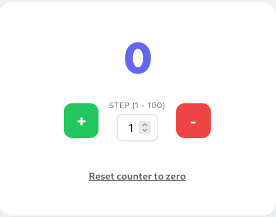

# WEB APP COUNTER PROJECT
## Start2Impact - Master in Fullstack Development

### Visit the site at [tiredviking.github.io/counter](https://tiredviking.github.io/counter/).
### Overview
- This web app was created as a project for Start2Impact Master in Fullstack Development. It is an app that allows the user to increase or decrease a counter, based on a selected step.  
Here is a screenshot of the UI:  

- The interface is generated dinamically using JavaScript;
- The counter can have negative numbers;
- The step can only be an integer between 1 and 100; floats are not allowed;
- Input validation for the step is done when clicking on the + or - button; if the input is invalid an alert is displayed on screen;
- Clicking on the reset button sets the counter to 0, but does not reset the step to 1;
- Reloading the page resets the counter to 0 and the step to 1.
